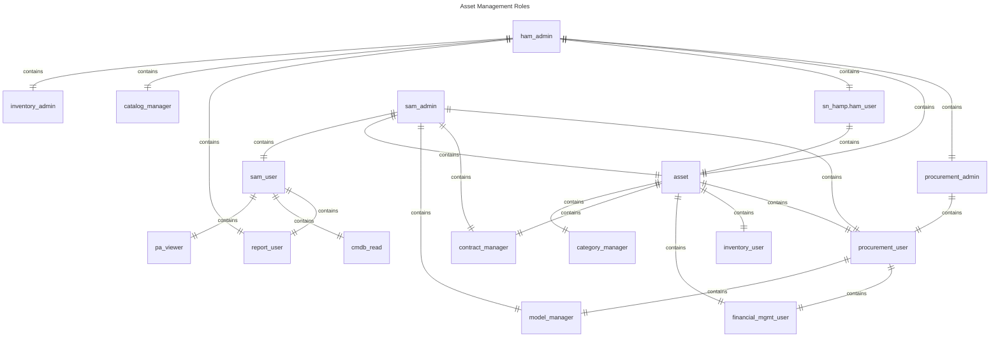

# Asset Management Roles

Trying to make sense of the roles and how they link to one another.

```mermaid
---
title: Asset Management Roles
---
erDiagram
    ham_admin ||--|| inventory_admin : contains
    ham_admin ||--|| catalog_manager : contains
    ham_admin ||--|| report_user : contains
    ham_admin ||--|| "sn_hamp.ham_user" : contains
    ham_admin ||--|| asset : contains
    ham_admin ||--|| procurement_admin : contains
    
    "sn_hamp.ham_user" ||--|| asset : contains

    sam_admin ||--|| sam_user : contains
    sam_admin ||--|| asset : contains
    sam_admin ||--|| model_manager : contains
    sam_admin ||--|| contract_manager : contains
    sam_admin ||--|| procurement_user : contains

    sam_user ||--|| pa_viewer : contains
    sam_user ||--|| cmdb_read : contains
    sam_user ||--|| report_user : contains

    asset ||--|| category_manager : contains
    asset ||--|| contract_manager : contains
    asset ||--|| financial_mgmt_user : contains
    asset ||--|| inventory_user : contains
    asset ||--|| procurement_user : contains

    procurement_admin ||--|| procurement_user : contains

    procurement_user ||--|| model_manager : contains
    procurement_user ||--|| financial_mgmt_user : contains
```
