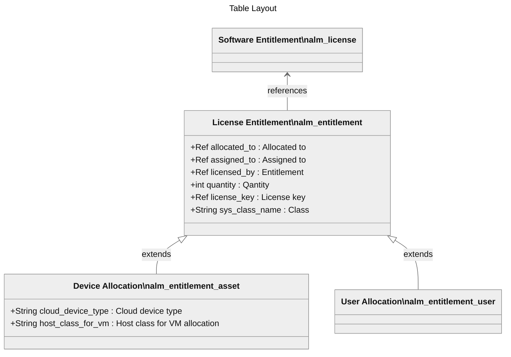

# Import Entitlements and Allocations

More mature organizations may have software allocations already identified in places such as a SharePoint site, an Excel spreadsheet, or even potentially in another database. To facilitate transferring this data to ServiceNow Software Asset Management Professional, software allocations can be imported.

This capability is also valuable from a project management perspective where multiple users or devices need allocations as part of the project. it may be easier to identify all allocations on a spreadsheet, for instance, and then import the spreadsheet.

Overall process:

1. Extract the Software Entitlement record first
2. Add a reference value such as Asset Tag or Sys ID as data to the template
3. Create an Import Set/Transform Map to bulk load device/user allocations

## Importing User Allocations

Import user allocation data into the **User Allocations [alm_entitlement_user]** table.

1. Create a CSV file that contains the user allocation information, with the following columns:
    - `assigned_to`: user to whom the entitlement is assigned (email or username).
    - `licensed_by`: name of the entitlement
    - `quantity`: number of entitlements assigned to the user (Default is 1)
    - (If applicable) `license_key`: corresponding license for the user entitlement
2. Create a data source and transform map to load the data into the `alm_entitlement_user` table
    - Recommendations:
      - Map the `assigned_to` attribute to an active record in the `sys_user` table.
      - Coalesce on `licensed_by` and `assigned_to`
      - Set `choice_action` for the `assigned_to` field to "Ignore"
3. Attach the CSV to your data source and run the transform map
4. Verification
    - navigate to the **User Allocations [alm_entitlement_user]** table and verify that the data has been correctly imported
    - navigate to the Software Entitlement to verify that the data has been correctly imported
5. Error Handling
    - Navigate to **System Import Sets > Import Set Runs** to view any error messages.

## Importing Device Allocations

As above but, import device allocation data into the **Device Allocations [alm_entitlement_asset]** table.

1. Create a CSV file that contains the device allocation information with the following columns:

   1. `allocated_to`: the device that is consuming the license
   2. `licensed_by`: the name of the entitlement
   3. `quantity`: number of entitlements assigned to the device (Default is 1)
   4. (If applicable) `license_key`: corresponding token for the device entitlement

2. Create a data source and transform map to load the data into the `alm_entitlement_asset` table.

   1. Recommendations:

      - Map the `allocated_to` attribute to a record in the CMDB.

      - Coalesce on `licensed_by` and `allocated_to`

      - Set `choice_action` for the `allocated_to` field to "Ignore"

3. Attach the CSV to your data source and run the transform map.

4. Verification

   - navigate to the **Device Allocations [alm_entitlement_asset]** table and verify that the data has been correctly imported.
   - navigate to the Software Entitlement to verify that the data has been correctly imported.

5. Error Handling

   - Navigate to **System Import Sets > Import Set Runs** to view any error messages.

## References

- [Create a File type data source](https://docs.servicenow.com/bundle/xanadu-integrate-applications/page/administer/import-sets/task/create-file-type-data-source.html)
- [Transform maps](https://docs.servicenow.com/bundle/xanadu-integrate-applications/page/script/server-scripting/concept/c_CreatingNewTransformMaps.html)

- Require "import_admin" role for data source and transform map.

## Additional topics

- Another suggestion of using Remediation Options to auto-allocate:

  - https://www.servicenow.com/community/sam-forum/sam-pro-auto-allocation-of-software-entitlement-from-software/td-p/1338136?nobounce

  - > Following the import if the software entitlement records, run a reconciliation and in the Remediation Options for the software models in question, you can select Create allocations and automatically allocate the available entitlement rights.

- [User Allocations are missing under Software entitlement](https://support.servicenow.com/kb?id=kb_article_view&sysparm_article=KB0830240)
- [Import bulk entitlements in Software Asset Management classic](https://docs.servicenow.com/bundle/washingtondc-it-asset-management/page/product/software-asset-management2/task/view-entitlement-import-errors.html)
- 
