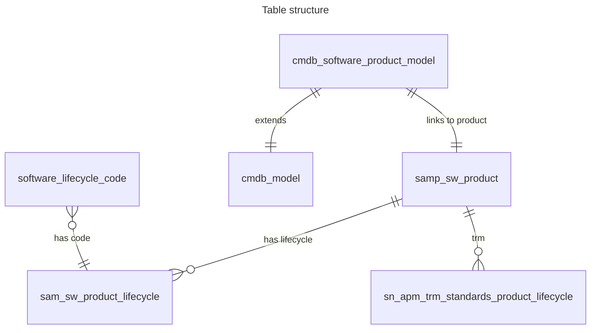
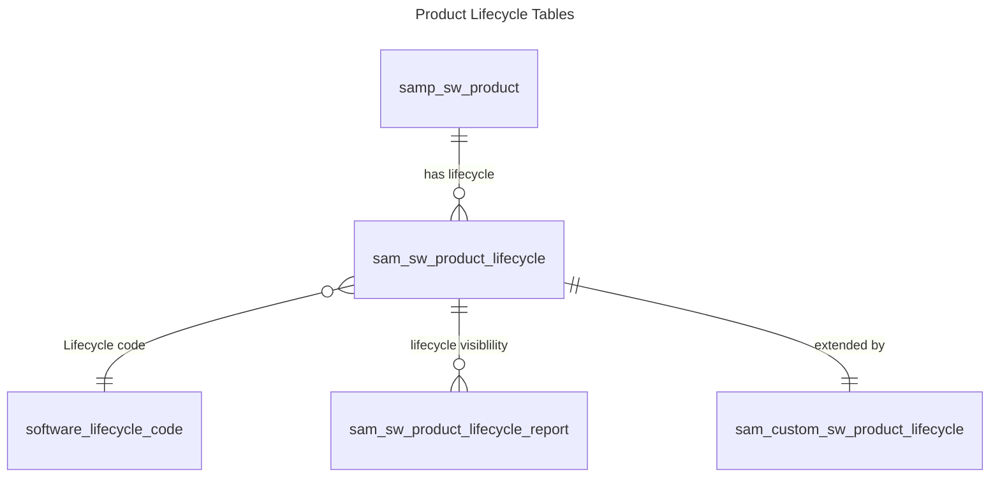

# Software Lifecycle Stuff

Table structure



Related list for lifecycle on software model, is define via Relationships [sys_relationship]: Software Product Lifecycles

Ref: /sys_relationship.do?sys_id=a87fd7ab53311010caaaddeeff7b124f

Script:

```javascript
(function refineQuery(current, parent) {
    // SAM use case
    if (GlidePluginManager.isActive("com.snc.sams")) {
        current.addQuery("norm_product", parent.product);
    } else {
        current.addQuery("publisher", parent.manufacturer);
        current.addQuery("product_name", parent.name);
    }
	current.addQuery('active', 'true');
	SamLifeCycleUtils.queryVersionAndEdition(current, parent);

    current.orderBy("norm_version");
    current.orderBy("norm_full_version");
    current.orderBy("start_date");

})(current, parent);
```

To calculate set `com.snc.samp.use_lifecycle_approximation` property to true



Inner workings of software installation creation and deletion of ServiceNow SAM Pro:
https://www.servicenow.com/community/sam-blog/understanding-the-inner-details-of-software-install-creation-and/ba-p/2734897?nobounce

Report on Software Product End of Life or End of Service:
https://www.servicenow.com/community/sam-forum/report-on-software-product-end-of-life-or-end-of-service/m-p/1314131?nobounce
