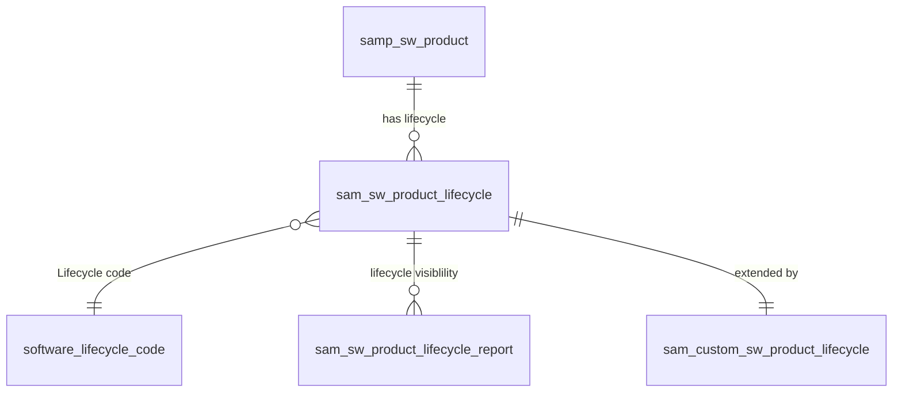

# Software Product Lifecycles

[toc]

## Introduction

Understanding and tracking the lifecycle of your Software Products is essential for maintaining operational efficiency and mitigating risks. Within ServiceNow, Asset Managers can track six lifecycle phases, offering valuable insights into the lifetime of software products:

Descriptions of the lifecycle phases:

1. **Pre-release**: Software release has been announced. Will help in planning and preparing for the software release.
2. **General Availability (GA)**: When the software release is available to the market. Will help in planning deployments.
3. **Upgrade**: References the availability of new versions or upgrades of the software, to maintain up-to-date systems.
4. **End of Life (EOL)**: When the publisher indicates they will no longer market, selling or improve the software. Tracking is essential to avoid using outdated software, so it should be available to request. 
5. **End of Support (EOS)**: Refers to the publisher only providing stability and security fixes. Use this to prepare for upgrades to new versions or alternative products.
6. **End of Extended Support (EOES)**: When the publisher will no longer provide support and security fixes for the software.

## Software Product Lifecycle Table

The **Software Product Lifecycle table [sam_sw_product_lifecycle]** table holds information of the software product, its lifecycle type (internal or external), full version, lifecycle phases, started dates of the phase, and the risk.

This table is used in the **Software Product Lifecycle** report, to inform you about products nearing end-of-life, end-of-support, and end-of-extended support. View the report by navigating to **Reports > View/Run**. The data in the report is based on the daily scheduled job, `SAM - Generate Data For Software Lifecycle Report`.

## Content Updates

Using the Software Asset Management Content Service has can help improve normalization hits ratios and provides externally defined or publisher-defined lifecycle information of the software product.

The following types of content can be updated as part of a content update:

- Categories
- Discovery maps
- Normalization suggestions
- Product classifications
- Product license exception rules
- Product names
- Product types
- Publishers
- Suite definitions
- Software model lifecycles
- Software model suggestions
- Unrecognized subscription identifiers
- Common Platform Enumeration (CPE) normalization rule

A weekly scheduled job (**SAM - Apply latest content changes**) runs and processes the content updates. After the content download is complete, the updated content is pulled into the staging columns of the following tables:

- Software Publishers [samp_sw_publisher]
- Software Products [samp_sw_product]
- Discovery maps [samp_sw_entitlement_definition]
- Software Product Definitions [samp_sw_product_definition]
- Product License Exception Rules [samp_prod_lic_excep_rules]
- Unrecognized Subscription Identifiers [samp_sw_unrecognized_subscription_identifier]

> **Note 1:** If a content update adds lifecycle data, it can't be deleted from the software model, but you can deactivate it. Any lifecycle data that is added as part of a content update will have the source set to **ServiceNow**.

> **Note 2:** Content updates do not impact custom products or custom discovery maps.

## Software Lifecycle Report

The **Software Lifecycle Report [sam_sw_product_lifecycle_report]** table calculates the current and upcoming lifecycle phases from the lifecycle phases mentioned in the **Software Product Lifecycle [sam_sw_product_lifecycle]** table.

For records with the same publisher, product, version, full version, and edition, there's a single record for different lifecycle phases. This helps in avoiding duplicate software installation count for each lifecycle phase. You can export lifecycles from the **Software Installation [cmdb_sam_sw_install]** table. The software installation records are linked to lifecycles via the Installs associated to lifecycle column in the **Software Installation [cmdb_sam_sw_install]** table.

The following columns have been added to **Software Lifecycle Report [sam_sw_product_lifecycle_report]** table:

| New column label and name                                    | Description                                                  |
| ------------------------------------------------------------ | ------------------------------------------------------------ |
| Current phase [current_lifecycle_phase]                      | The lifecycle phase that is currently underway.              |
| Current lifecycle phase start date [current_lifecycle_phase_start_date] | The start date of the current lifecycle phase.               |
| General Availability start date [ga_start_date]              | The start date of the General Availability lifecycle phase   |
| General Availability lifecycle [ga_lifecycle]                | Reference to the General Availability lifecycle              |
| End of Support start date [eos_start_date]                   | The start date of the End of Support lifecycle phase         |
| End of Support lifecycle [eos_lifecycle]                     | Reference to the End of Support lifecycle                    |
| End of Extended Support start date [eoes_start_date]         | The start date of the  End of Extended Support lifecycle phase |
| End of Extended Support lifecycle [eoes_lifecycle]           | Reference to the End of Extended Support lifecycle           |
| End of Life start date [eol_start_date]                      | The start date of the End of Life lifecycle phase            |
| End of Life lifecycle [eol_lifecycle]                        | Reference to the End of Life lifecycle                       |
| Upcoming lifecycle phase [upcoming_lifecycle_phase]          | The lifecycle phase that is soon coming up.                  |
| Upcoming lifecycle phase start date [upcoming_lifecycle_phase_start_date] | The start date of the upcoming lifecycle phase.              |
| Owners [owners]                                              | The person responsible for the software model.               |

## End of Life and End of Support Lifecycles

To maximize the effectiveness of lifecycle management, it is essential that you have comprehensive lifecycle data for all software models in your instance. Some strategies include:

- Creating internal software lifecycles
- Utilize lifecycle averages
- Enable approximate lifecycles

If vendor-provided lifecycles are not provided for specific software, it you can use calculated lifecycles to assess and manage your risks by creating EOL and EOS lifecycles for your software products. 

### Calculated lifecycles

You can create EOL and EOS lifecycles based on industry averages, measured in months, from the **General Availability (GA)** dates.

> **Note:** The lifecycles can be created by the `sam_user` or the `sam_admin` role.

You can override the global industry averages by specifying custom values pertaining to a product or a publisher. The lifecycles are calculated based on the product or publisher values that you specified. 

When creating EOL or EOS lifecycles, keep the following pre-requisites in mind:

- The Software Asset Management Professional plugin is activate.
- That General Availability dates are available for the product.
- EOL and EOS lifecycles not provided by the Content Service.
- Product is shipped by the Content Service.

### Lifecycle Process

There two scheduled jobs:

- `SAM - Generate Data For Software Lifecycle Report` 
  - Collects data for lifecycles for products whose GA dates are available and published by the Content Service.
  - Runs daily at midnight

- `SAM - Create Calculated Software Lifecycles` 
  - Will create EOL/EOS lifecycles if there are no records created by you or the Content Service.
  - Runs weekly on a Saturday

In order for the `SAM - Create Calculated Software Lifecycles` job to generate the records, the `com.snc.samp.generate.calculated.lifecycles` property needs to be enabled. This will be activated as part of [STRY0071331](https://scotiabankprogram.service-now.com/rm_story.do?sys_id=5a08c36c3b819a10e9227b6aa5e45a9f). 

The calculated life cycles and the lifecycles created by the SAM Admin are stored in the **Custom Software Product Lifecycle [sam_custom_sw_product_lifecycle]** table. Life cycles created by the Content Service are stored in the **Software Product Lifecycle [sam_sw_product_lifecycle]** table.

The industry averages are stored in the Software Lifecycle Averages [samp_sw_lifecycle_averages] table. The life cycles created using these averages have their source column defined as calculated.

> **IMPORTANT:**  If you create an EOS or EOL record, then an EOL or EOS created by the scheduled job gets deleted in the next Content Service update, as priority is given to the custom records that you create.

### Lifecycle Date Approximation

To improve life cycle report coverage, approximate life cycles dates are assigned to life cycles without a date. They are included in the report when the `com.snc.samp.use_lifecycle_approximation` property is enabled.

The `Lifecycle code` column is added to the **Software Product Lifecycle [sam_sw_product_lifecycle]** table. This references the **Software Lifecycle Code [software_lifecycle_code]** table. If approximate dates are assigned to a life cycle this column will be populated, otherwise it will be empty if the lifecycle has confirmed dates.

The table structure can be demonstrated in the diagram below

Visibility of all the lifecycle phases can be observed in the Software Lifecycle Reports table, at the [top of this section](#software-lifecycle-report).

> **Note:** EOL, EOS, and EOES dates for all build versions are not shipped by the Content Service. The life cycle report inherits such dates from the generic version.

### Lifecycle Calculation Codes

Below is a summary of codes used to demonstrate how the lifecycle dates were calculated.

| Code           | Short Description                                            |
| -------------- | ------------------------------------------------------------ |
| APX001         | End-of date is inherited from version                        |
| APX002         | Date is inherited from parent product                        |
| APX003         | Date is inferred based on lifecycle policy                   |
| APX004         | Date is obtained from sources other than publisher websites  |
| APX005         | Date is extrapolated based on release patterns               |
| APX006         | General availability date is inherited from earliest full version |
| APX007         | Earliest date across platforms                               |
| APX008         | GA for full version is inherited from (Generic) version      |
| APX009         | General availability date is inherited from the earliest full version (build version) |
| **Ended**      | *(product or version has reached the end of the phase, such as EOL ,EOS, or EOES)* |
| END001         | End-of date due to later version(s); no date is provided     |
| END002         | End-of date due to deprecated product; no date is provided   |
| **Exceptions** | *(reason why the date is blank)*                             |
| EXC001         | Publisher sources are not accessible                         |
| EXC002         | Date is not published, or publisher has not made the date available publicly |
| EXC003         | Product type is Child, Driver, Patch, or Unknown; no date is provided |
| EXC004         | Contract-based support; no date is provided                  |

 ## Managing lifecycles

The **Software Asset Management** (SAM) application uses the software CIs from Discovery to build an inventory of software models, license allocations, and usage across the company.

APM’s **Technology Portfolio Management** (TPM) feature uses the SAM software inventory to manage the vendor and internal life cycles for each technology. Finally, you link each business service to its underlying technologies by creating entries in the Business Service Software Models table.

Together, APM and its application suite let you manage your enterprise apps in alignment with the business services they support and the business capabilities they’re used for.

### Strategies for discovering EOL software

- Conduct a comprehensive software audit
  Gain a holistic view of all software being used within the organization. Evaluate usage patterns, contract terms, renewal dates and integration dependencies.
- Encourage cross-department collaboration
  Build strong collaborative relationships between IT, procurement, finance and other departments to ensure applications and their lifecycle information is communicated.
- Establish regular vendor communication
  Open and maintain communications with software vendors to stay informed regarding pending changes, product sunsets, EOL announcements.
- Implement an asset retirement plan
  Have a strategy to retire, upgrade, or migrate your products when the version changes or the sunset is announced. These strategies should include data backup, knowledge transfers, as well as verifying compliance with data protection and privacy regulations.  
- Leverage SAM Pro to automate the discovery process and help you manage EOL software

### Improving Software Lifecycle Data

As mentioned previously, not all EOL, EOS and EOES dates are shipped for all Software versions, whereby you can enable the functionality to calculate the dates, and codes are provided to indicate how the calculation was made. The lifecycle dates in the SAM Content Service are based on publicly published data by vendors.

It is a recommended that a TRM strategy is implemented to review your Software Products and identify any gaps in the lifecycle dates, including steps towards remediation.[^1]

Steps that can be taken are:

- Create Internal Software Lifecycles
- Create Software Lifecycle Averages
- Use Approximate lifecycles

#### Create Internal Software Lifecycles

The following sites are examples of external resources to determine EOL/EOS[^2] dates of your installed products:

- [Microsoft End of Support and Retirements](https://docs.microsoft.com/lifecycle/products/)
  - There is also a facility to [export](https://docs.microsoft.com/lifecycle/products/export/) the data
- [endoflife.date](https://endoflife.date/)
- [endoflife.software](https://endoflife.software/)

Keep in mind that you should be clear on your definitions of EOL and EOS, and how they are recorded within your system. In addition to that, there are cases where vendors do not distinguish between the two lifecycles.

If you have identified publicly shared lifecycle dates that is otherwise missing from the content service, you can raise a request for ServiceNow to update the respective Product, Version, Edition, and lifecycle phase.

#### Create Lifecycle Averages

Alternatively, you can update the lifecycles as described in the [Lifecycle Process](#lifecycle-process) section or define averages (as mentioned in [Calculated lifecycles](#calculated-lifecycles)) specific to a product or publisher. These averages are used to create calculated lifecycles for products. Work with your SAM Manager to capture and create this information in the platform.

#### Use Approximate Lifecycles

As mentioned in the [Lifecycle Date Approximation](#lifecycle-date-approximation) section, you can enable a property so that the system can calculate an approximate date based on the available data.

[^1]: There are cases where vendors do not provide an end date, and a product version is considered deprecated or EOL when a new version of the product is released. 
[^2]: This will not include EOES as this is concerned with support contracts.

