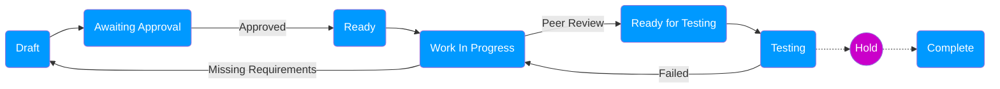

# Typical Lifecycle of a Story

## Flow

The following is an overview of the positive and negative flows in the lifecycle of a Sprint Backlog Item[^1]. 

The rest of the document describes managing the Sprint Backlog Item using ServiceNow's Agile application.

## General Guidelines

* Ensure _**all**_ communications are captured within the Story.

  * For example: Attach the email that contains the Approval

### Draft

* Stories would be refined/primed in the _Draft_ state

* This is where the **Business Analyst** would conduct their analysis of the requirements and present the requirement as an **Agile User Story**.

* If there are additional conversations via emails it is recommended to attach them to a **Scrum Task** (with the type as Analysis).

* If a **Technical Architect** is involved and would like to provide implementation guidelines, they can do so by adding the information to a **Scrum Task** (with the type as Documentation).

### Ready

* Stories in the _Ready_ state is an indication that it is ready to be worked one as part of Sprint Planning.

* When a Story in the _Ready_ state has been identified with issues:

  * It should go back to the _Draft_ state.

  * Communicate this with the **Scrum Master** and the **Business Analyst**.

  * The **Business Analyst** should discuss the item(s) with the relevant **stakeholder** (usually the Process Owner) to re-work the Story.

### Work In Progress

* Capture steps for deployment in a **Scrum Task** (with the type of Documentation).

  * If a Story is returned from the _Testing_ state, update the deployment notes with the new Update Set version(s).

* Any technical information around the development (e.g. different from recommendations) can be captured as another **Scrum Task** (with the type of Documentation).

### Ready for Testing

* When moving a Story from the _Work In Progress_ state to the _Ready for Testing_ state:

  * The **Peer Review** must be captured in a **Scrum Task** (with the type of Coding)

* Keep in mind a separate process would be in place to deploy the code to the Test/QA instance

  * The System Administrator(s) should track the the order and steps for later deployment to Production

* Comments regarding Testing and the test result must be captured within **Scrum Tasks** (with the type as Testing).

### Testing

* When a test case has _failed_, depending on the issue, the Story would:

  * go back to the _Work in Progress_ state for the developer to fix the issue, **OR**

  * be blocked and taken out of the Sprint for the **Business Analyst** to re-evaluate the Story.

* With a successful test, the Story is held until the Update Set(s) is ready for deployment to Production.

### Complete

* A **Change Request** is raised for the deployment to Production.

[^1]: This is the correct term for a work item in a Sprint, while ServiceNow calls it a Story.
