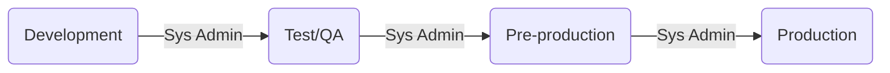
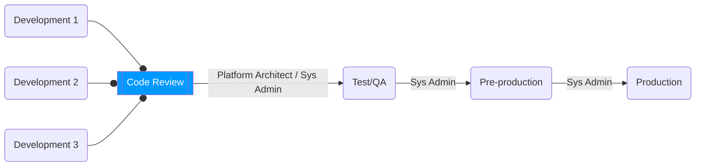
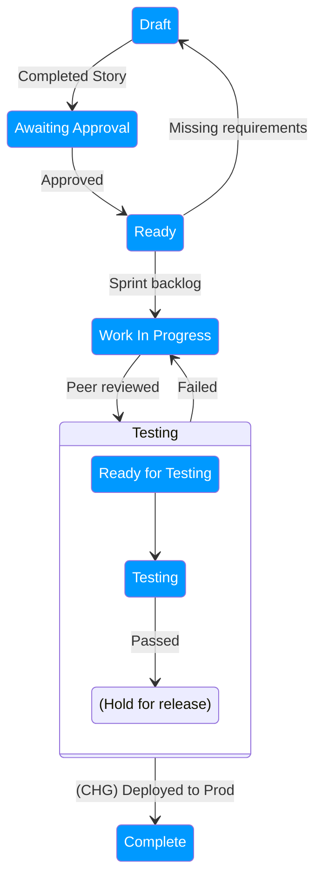

# Environment Governance

## Instance Stack

| Instance       | Purpose                                                     |
| -------------- | ----------------------------------------------------------- |
| Development    | All development takes place in this instance + unit testing |
| Test/QA        | QA, Integration Testing, and UAT                            |
| Pre-Production | Staging (Dry Run)                                           |
| Production     | Live                                                        |

## Personas per Instance

Only System Administrators have the admin role throughout the entire Instance stack.

### Production

- System Administrator
- Scrum Team
  - Business Analyst
  - Technical Writer
  - Developer (does *not* have admin access to Production)
- Scrum Master
- Knowledge Manager
- Stakeholder
  - To review and approve stories for implementation
- Technical/Platform Architect(s)

### Pre-Production

- System Administrator
- Developer
  - Temporarily assigned admin role to troubleshoot issues

### Test/QA

- System Administrator
- Tester 
  - requires *impersonator* role
- Developer 
  - requires full admin access to troubleshoot issues

### Development

- Developer 
  - requires full admin access
- System Administrator

## Updating Stories

Stories in the Product/Demand backlog may be worked on by the Business Analysts in parallel to running Sprints.

With this in mind, the Story's description or Acceptance Criteria would be worked on by the **Business Analyst** and the **TDA**[^1]. However, once a Story has been added to a Sprint Backlog[^2] as a Sprint Backlog Item, ownership is with the Business Analyst. Developers should not be updating them. 

If the story does require further updates, (for example new Acceptance Criteria), the Story would need to go through the approval process again with the respective stakeholder. Or another process, as dictated by the business, is followed to ensure there is a clear audit for changes.

## Deployment Models

An overview of the instance responsibilities for Agile deployment with a small number of teams

Here is an example, when in a multi-development team model where more dev instances are involved:

Note that a *Code Review* is indicated before code is deployed "up-the-stack". This is usually conducted by the Platform Owner with the following attendees:

+ Platform Architect(s)
+ Technical Architect(s) or Lead Developer(s) - if applicable
+ Developers involved in the deployment of work items
+ Stakeholders

## Deployment of Development Work

In the NOW Platform, the development work is usually captured/tracked in an *Update Set*. However, there are occasions where the work is not tracked and manual steps would need to be applied during the deployment process. Nevertheless, the process of moving this code or applying steps is considered deployment.

The following diagram demonstrates a flow of of a work item[^2] Item:

### General Guidelines

+ Ensure **all** communications are captured within the work item.
  + For example: Attach the email that contains any approvals.
+ Ensure all actions are captured as a related task against the work item.
  + This is highly recommended to help maintain an audit for regulated sectors.

+ Deployment is performed by the System Administrator.
  + It is recommended that the Story's work notes is updated to reflect when the Update Set has been deployed to another Instance.

### Draft

+ *Draft* Stories from the Product Backlog would be refined/primed.
+ This is where the **Business Analyst** would conduct their analysis of the requirements and present the requirement as an **Agile User Story**.
+ If there are additional conversations via emails it is recommended to attach them to your work item or a related task (in ServiceNow use a **Scrum Task** with the type as *Analysis*).
+ If a **Technical Architect** is involved and would like to provide implementation guidelines, they can do so by adding the information to the story as a related task[^3].

### Ready

+ Work items in the *Ready* state is an indication that it is ready to be reviewing in [Sprint Planning](https://scrumguides.org/scrum-guide.html#sprint-planning "Definition of Sprint Planning") for an upcoming Sprint.
  + Outcome of this is to have the work item allocated to a [Sprint Backlog](https://scrumguides.org/scrum-guide.html#sprint-backlog).
+ When a work item in the *Ready* state has been identified with issues:
  + It should go back to the *Draft* state.
  + Communicate this with the **Scrum Master** and the **Business Analyst**.
  + The **Business Analyst** should discuss the item(s) with the relevant **stakeholder** (usually the Process Lead) to re-work the Story.
  + Common scenario: If the estimation of effort for a Story is high (i.e. too many points to be considered a work item), this would be fed back to the **Business Analyst** to continue refining the story into manageable chunks (i.e. work items).[^INVEST]

### Work In Progress

+ These are active work items during a Sprint.
+ Capture the *steps for deployment* in the work item or a related task[^3].
  + If continuing to work on an item that was returned from the *Testing* state, update the deployment notes with the new Update Set version(s)[^4].
  + These steps should include all other steps for manual actions that fall outside of the Update Set.
  + This will be used to build the TIP[^5].
+ Any technical information around the development (e.g. different from recommendations) can be captured as a related task[^6].
+ When nearing completion of the work item, **Unit testing** is conducted on work item by the developer, in addition to performing Best Practice checks using the available automation tools[^7].

### Ready for Testing

+ When you believe your work item is ready to progress to the testing state a **Technical Peer Review** is conducted:
  + Many organisations publish a checklist or guidelines for this activity.
  + It is recommended to capture this in a related task.[^8]
+ The story can then progress from the *Work In Progress* state to the *Ready for Testing* state
+ Keep in mind a separate process would be in place to deploy the code to the Test/QA instance.
  + The System Administrator(s) or Release Manager should track the the order and steps for later deployment to Production[^9].

### Testing

+ When a test case has *failed*, depending on the issue, the Story would:
  + go back to the *Work in Progress* state for the developer to fix the issue, **OR**
  + be blocked and taken out of the Sprint for the **Business Analyst** to re-evaluate the Story. 
+ Comments regarding Testing and the test result must be captured within related tasks.[^10]
  + With a successful test, the Story is held until the Update Set(s) is ready for deployment to Production.

### Complete

+ A **Change Request** is raised for the deployment to the *Pre-Production* Instance.
+ Following a successful dry run, a **Change Request** is raised for the deployment to the *Production* Instance.
+ The Change Requests would follow your organisation's Change Model for ServiceNow deployment.
+ Following a successful deployment to the *Production* instance, the work item can be closed.

## Where is the Product Backlog?

As you would have noticed, the above process describes the lifecycle of a work item during an Agile or Scrum sprint. These are items being worked on from the *Sprint Backlog*, which are items selected from the *Product Backlog* to deliver the Product Increment. 

See this definition of the Product Backlog:

> The Product Backlog is an emergent, ordered list of what is needed to improve the product. It is the single source of work undertaken by the Scrum Team.
> 
> Product Backlog items that can be Done by the Scrum Team within one Sprint are deemed ready for selection in a Sprint Planning event. They usually acquire this degree of transparency after refining activities.
> **--** [Scrum Guide](https://scrumguides.org/scrum-guide.html#product-backlog)

However, please note, this Environment Guidance is to demonstrate how the ServiceNow Instance stack correlates to the lifecycle of a Sprint Backlog Item, within a recommended framework. This is not intended to be an Agile practice document.

## Testing Best Practices

It is important that your organisation has published a set of guidelines for testing (test strategy). This guidance is not intended to go into that detail. However, from a high-level the following is recommended:

+ That the **Unit testing** by the developers are conducted and the results captured into the relevant work item or related task.
+ That the tester(s) are included in the *Sprint Review*[^11] so that they can create relevant end-to-end test plans for the product increment.
+ Leverage ServiceNow's [Automated Test Framework](https://www.servicenow.com/docs/bundle/yokohama-application-development/page/administer/auto-test-framework/concept/automated-test-framework.html) (ATF) functionality where possible.
+ Include the relevant stakeholder(s) during UAT
  + Allow an agreed upon time frame (for example, 2 weeks) for User Acceptance Testing (UAT).
  + Ensure feedback sessions are scheduled so that issues  or enhancements can be assessed and planned.
  + Outputs of UAT should be captured in the work item or a related task.

[^1]: Technical Design Authority.
[^2]: Be aware that the correct terminology for a piece of work in a Sprint is *Sprint Backlog Item* or in other Agile environments (including DevOps) as a *work item*, while ServiceNow's Agile application continues to refer to them as Stories.
[^3]: In the ServiceNow Agile application it is recommended to create a **Scrum Task** with the type of *Documentation*.
[^4]: It is highly recommended to have a documented naming convention for your Update Sets. 
[^5]: Technical Implementation Plan.
[^6]: In the ServiceNow Agile application it is recommended to create a **Scrum Task** with the type of *Documentation*.
[^7]: The NOW Platform provides functionality to "Run a Point Scan" against an Update Set.
[^8]: In the ServiceNow Agile application use a **Scrum Task** with the type of "Coding".
[^9]: Release records can be created and associated to Stories in ServiceNow's Agile app.
[^10]: Use **Scrum Tasks** with the type as Testing in ServiceNow's Agile application for this purpose.
[^11]: A product increment is inspected in a [sprint review](https://scrumguides.org/scrum-guide.html#sprint-review). 
[^INVEST]: Independent, Negotiable, Valuable, Estimable, Small, Testable
